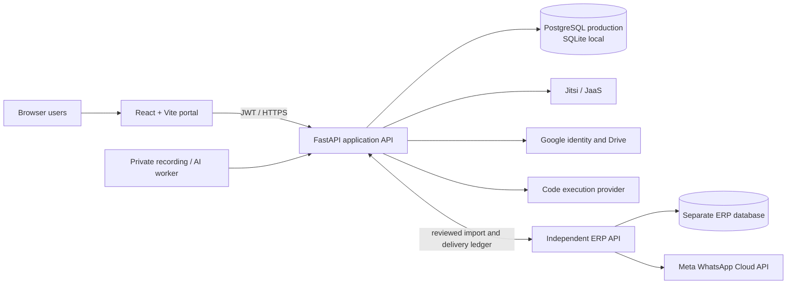

# EKEEKRTA

### Multi-tenant learning, classroom, training, ERP, and explainable AI platform

[Live application](https://ekeekrta.vercel.app) · [Backend health](https://smart-virtual-lms-backend-gules.vercel.app) · [ERP sandbox](https://ekeekrta-erp-sandbox.vercel.app) · [Documentation](docs/README.md)

> **Portfolio status:** EKEEKRTA is a development-stage full-stack project. Its primary workflows are implemented and publicly deployed for demonstration. External services, production security review, institutional data governance, and classroom capacity testing are still required before real institutional use.

## Why EKEEKRTA exists

Educational institutions often use disconnected systems for user records, courses, virtual classes, attendance, assessments, academic reporting, training delivery, and communication. Faculty repeatedly enter the same information into incompatible platforms, students switch between portals, and administrators lack a consistent view of activity.

EKEEKRTA explores one institution-aware platform that connects these workflows while keeping authorization, tenant boundaries, and human approval at the centre of the design.

## What the project demonstrates

- **Multi-tenant SaaS architecture** with institution-scoped data and a separate platform-operator role.
- **Two operating models:** universities and training institutions receive different terminology and workflows.
- **Role-based access control:** platform administrator, institution administrator, HOD, faculty/trainer, and student/learner.
- **Course and batch workspaces** containing classes, attendance, assignments, quizzes, learning materials, progress, and roster management.
- **Virtual classrooms** through server-issued Jitsi/JaaS meeting credentials; selecting a role in the browser never grants moderator access.
- **ERP interoperability** using reviewed imports and a durable outbound synchronization ledger.
- **Explainable native AI foundations** for role-aware commands, teaching drafts, cited course search, CGPA planning, progress insights, and reviewed lecture digests.
- **University data exchange** that maps EKEEKRTA records into reusable export templates for other institutional systems.
- **Training delivery** with programs, dated batches, modules, ordered lessons, enrollment, progress, recordings, analytics, and certificate eligibility.

## System overview



The frontend never receives database, video-signing, ERP, SMTP, or OAuth client-secret credentials. Authorization is rechecked by the backend for every protected resource.

## Product areas

| Area | Current capability | Status |
| --- | --- | --- |
| Institution onboarding | University/training-institution profile, first administrator, branding and themes | Implemented |
| University operations | Departments, semester-aware courses, HOD scope, faculty tools and student portal | Implemented |
| Training operations | Programs, batches, trainers, learners, modules, progress and certificates | Implemented |
| Classroom | Scheduling, authenticated meeting access, join/leave duration, fullscreen policy and end-for-all control | Implemented; video provider credentials required |
| LMS | Courses, enrollment, assignments, grading, quizzes and study materials | Implemented |
| Programming assessment | Test-case authoring, code execution adapter and scored submissions | Implemented; runner required |
| ERP | Reviewed user import, course/attendance export, retry ledger and independent sandbox | Implemented |
| Offline attendance | ERP roster entry, academic register and absence-notification queue | Implemented |
| Native AI | Deterministic command routing, approval workflow, retrieval, planning and progress explanations | Implemented foundation; no bundled generative model |
| Voice AI | Browser recording UI plus a private executable contract and evaluation gate | Interface implemented; trained voice model not bundled |
| Recording intelligence | Private upload/worker pipeline, reviewed transcript digest and publication workflow | Foundation implemented; automatic STT requires local models/infrastructure |
| Gamification | Full points, achievements, streaks and ranked leaderboard system | Planned |

See [Feature status](docs/features.md) for the complete, honest implementation matrix.

## Roles and access boundaries

| Role | Scope |
| --- | --- |
| Platform administrator | Manages institution lifecycle and platform audit records; cannot silently enter tenant academic areas |
| Institution administrator | Manages the institution profile, departments/domains, accounts, courses/batches and integrations |
| HOD | Reads faculty, students, courses and attendance only inside the assigned university department |
| Faculty | Manages owned university courses and their enrolled students, assessments and classes |
| Trainer | Manages assigned training batches, modules, learners, meetings and certificates |
| Student / learner | Accesses only personal records and explicitly enrolled courses or batches |

## Technology stack

| Layer | Technology |
| --- | --- |
| Frontend | React 18, React Router 6, Vite 5, custom responsive CSS |
| Backend | Python 3.12, FastAPI, Pydantic, SQLAlchemy |
| Authentication | JWT, bcrypt password hashing, verified Google ID tokens, role dependencies |
| Data | PostgreSQL in production, SQLite for isolated local development |
| Video | Jitsi IFrame API / JaaS with backend-signed meeting tokens |
| Integrations | Google Drive OAuth, ERP REST connector, Judge0-compatible code runner, SMTP, Meta WhatsApp Cloud API |
| Hosting | Vercel projects for frontend, backend and ERP sandbox; Neon-compatible PostgreSQL |
| Testing | Python `unittest`, API integration tests, React server-render checks and production builds |

## Repository structure

```text
EKEEKRTA/
├── frontend/                 React portal and role-specific dashboards
├── backend/                  FastAPI application, domain models and integrations
├── erp-dummy/                Independent ERP sandbox with its own API and database
├── deployment/jitsi/         Future private Jitsi/Jibri deployment guidance
├── docs/                     Architecture, status, setup and engineering references
├── deliverables/             Academic project deliverables
├── INSTITUTION_SETUP.md      Institution onboarding and migration operations
├── EKEEKRTA_OPERATIONS.md    Platform-operator runbook
└── VERCEL_DEPLOYMENT.md      Public deployment configuration
```

## Run locally

Prerequisites: Git, Node.js 20+, npm, and Python 3.12.

```powershell
# Terminal 1 — backend
cd backend
py -3.12 -m venv .venv
.\.venv\Scripts\python.exe -m pip install -r requirements.txt
Copy-Item .env.example .env
.\.venv\Scripts\python.exe -m uvicorn app.main:app --reload --port 8000

# Terminal 2 — frontend
cd frontend
npm install
Copy-Item .env.example .env
npm run dev
```

Open `http://127.0.0.1:5173`. Local API documentation is available at `http://127.0.0.1:8000/docs`. The optional ERP sandbox runs separately on port `9000`.

Read [Local development](docs/local-development.md) before configuring accounts, video, Google, ERP, or messaging integrations.

## Engineering decisions worth reviewing

- Tenant ownership is attached to application records and checked server-side, including guessed resource IDs.
- Roles are derived from authenticated accounts, never trusted from client-side selection.
- ERP imports are previewed before confirmation; outbound failures enter a retryable ledger instead of rolling back LMS actions.
- AI write operations start as previews and require confirmation. Permission checks run again at execution time.
- Student quiz responses do not expose correct answers before submission.
- Recording uploads are private and unavailable on serverless storage; large-media processing is delegated to an institution-controlled worker.
- External-service secrets remain backend-only and are excluded from source control.

## Documentation map

- [Documentation index](docs/README.md)
- [Architecture](docs/architecture.md)
- [Feature status](docs/features.md)
- [Local development](docs/local-development.md)
- [Development life cycle](docs/development-lifecycle.md)
- [Security and privacy](docs/security-and-privacy.md)
- [API guide](docs/api-reference.md)
- [Data model](docs/db-schema.md)
- [Resume and interview summary](docs/resume-summary.md)

## Verification

The repository contains backend, ERP, navigation, registration, classroom-layout, branding, integration and production-upgrade tests. The latest public release was also checked for:

- successful frontend production build;
- public HTTP availability of the three deployed services;
- protected backend route registration;
- current training, data-exchange and voice-interface bundle markers; and
- ERP offline-attendance and WhatsApp-alert screens.

Tests validate code behavior, not production readiness. Real multi-device video, load, disaster-recovery, deliverability, accessibility and security audits remain separate release gates.

## Current limitations

- No production capacity claim is made for 150-person meetings without network and media-server load testing.
- Automatic speech transcription, handwriting assessment, a custom generative model and autonomous institutional decisions are not bundled.
- WhatsApp delivery requires an approved Meta utility template, institution credentials and guardian consent.
- Public institution registration still needs stronger ownership verification, abuse prevention and an approval workflow.
- Schema compatibility helpers exist, but the project does not yet use Alembic migrations.
- Uploaded assignment work currently uses URLs rather than a complete managed object-storage flow.

## Project direction

The next production-oriented milestones are formal migrations, full observability, backup/restore automation, verified institutional onboarding, accessibility testing, private Jitsi/Jibri capacity testing, and evaluated institution-owned AI models.

This repository is intended to demonstrate system design, full-stack implementation, integration boundaries, authorization design, and transparent product engineering—not to present an academic prototype as a finished commercial service.
