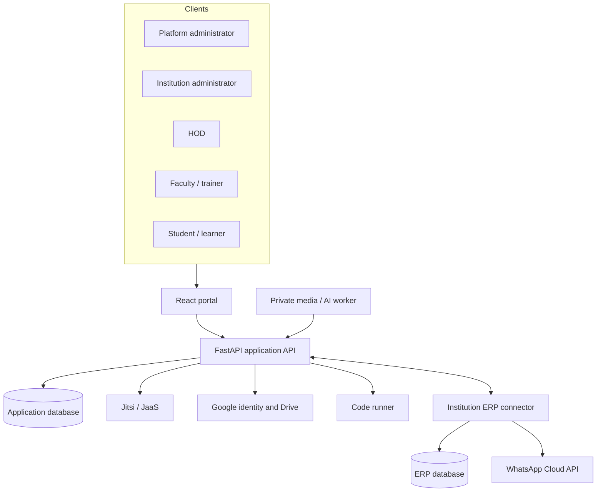

# EKEEKRTA architecture

## 1. Architectural goals

EKEEKRTA is designed as a multi-tenant education platform with five priorities:

1. keep one institution's records inaccessible to another institution;
2. support university and training-institution workflows without pretending they are identical;
3. grant classroom and data privileges from server-side identity, not browser controls;
4. integrate with external systems through explicit, recoverable boundaries; and
5. keep AI-generated or AI-assisted writes reviewable by a human.

## 2. System context



## 3. Deployable components

### Frontend (`frontend/`)

A React single-page application built with Vite. It provides institution onboarding, authentication, responsive dashboards, course/batch workspaces, classroom framing, ERP configuration, AI review interfaces and settings. Frontend routing improves navigation; it is not an authorization boundary.

### Application backend (`backend/`)

A FastAPI service containing domain models, validation schemas, role dependencies, tenant checks, classroom token creation, LMS workflows, training workflows, ERP delivery, Google integration and native-AI foundations. Protected routes derive the current user from a signed JWT and check the requested object's institution and role scope.

### ERP sandbox (`erp-dummy/`)

An independent FastAPI service with its own database and API token. It demonstrates the boundary an existing college ERP would expose: user directory, academic results, synchronized courses, online/offline attendance, academic register and notification delivery. It is deliberately not imported into the LMS process.

### Private worker boundary

Large recordings and institution-owned models do not run inside the Vercel request lifecycle. The recording worker claims queued jobs, verifies hashes, invokes reviewed local executables without a shell, and returns bounded structured output. Raw media stays in private storage and publication remains a separate faculty action.

## 4. Multi-tenant access model

Every institution-owned record is associated directly or indirectly with an `institution_id`. Access helpers combine:

- authenticated account identity;
- account role;
- institution ownership;
- department, course or batch assignment; and
- resource-specific rules such as faculty ownership or student enrollment.

The platform administrator operates outside tenant dashboards. Institution administrators can manage their own tenant but cannot address another tenant by changing a URL or resource ID. HOD access is department-scoped. Faculty access is course-scoped; trainers are batch-scoped. Students and learners receive only their own or enrolled resources.

## 5. University and training variants

The application shares identity, infrastructure and common learning objects while keeping different operating models:

| University | Training institution |
| --- | --- |
| Department | Domain |
| Faculty | Trainer |
| Student | Learner |
| Year and semester targeting | Dated program batches |
| Optional HOD role | No HOD role |
| Academic/non-academic course grouping | Program, batch, module and lesson structure |
| Optional ERP connector | No ERP workflow in the portal |
| Semester promotion | Batch membership and completion |

## 6. Important data flows

### Authentication

1. An administrator or ERP process provisions the account.
2. The user signs in with a password or a verified Google ID token.
3. The backend confirms the account, institution, domain and role.
4. The backend issues a JWT; subsequent routes repeat authorization checks.

Google sign-in does not create accounts or infer roles.

### Classroom and attendance

1. Faculty schedules or starts a class inside an owned course/batch.
2. The backend validates membership and signs provider-specific meeting access.
3. Join/leave events are paired into actual elapsed attendance.
4. Ending the session finalizes records, including enrolled students who never joined.
5. Final records enter the ERP delivery ledger when the institution enables synchronization.

Initial microphone/video mute is a client configuration, not an enforced disciplinary restriction. Moderator privilege comes from server authentication.

### ERP synchronization

Inbound users are fetched, compared by official identifier, previewed and confirmed. Conflicting role changes and ERP administrator accounts are rejected. Outbound courses and attendance enter an institution-scoped ledger. Network failure records a retryable error without undoing the original EKEEKRTA transaction.

### AI-assisted actions

1. A typed or locally transcribed command enters the same role-aware pipeline.
2. The system classifies intent and constructs a preview.
3. The user reviews and explicitly confirms or rejects it.
4. Authorization is checked again during execution.
5. The action and result are recorded for audit.

## 7. Data and deployment topology

Local development uses SQLite databases for the application and ERP independently. Public deployment uses separate Vercel projects and hosted PostgreSQL. Secrets are supplied through local `.env` files or protected deployment settings and are excluded from Git.

```text
ekeekrta.vercel.app
        │
        ├── smart-virtual-lms-backend-gules.vercel.app ── hosted PostgreSQL
        │
        └── ekeekrta-erp-sandbox.vercel.app ───────────── separate ERP database
```

## 8. Deliberate trade-offs

- SQLAlchemy startup compatibility helpers make local demonstrations simple, but formal Alembic migrations are still needed.
- The Jitsi IFrame API provides reliable meeting functionality quickly, but some in-meeting UI remains Jitsi-controlled.
- Deterministic AI baselines are explainable and locally owned, but they are not equivalent to a generative language model.
- Vercel is suitable for the portal and transactional APIs, not private video recording, long model inference or a self-hosted media bridge.
- The ERP service is a contract sandbox, not a claim of integration with a specific institution's live ERP.
