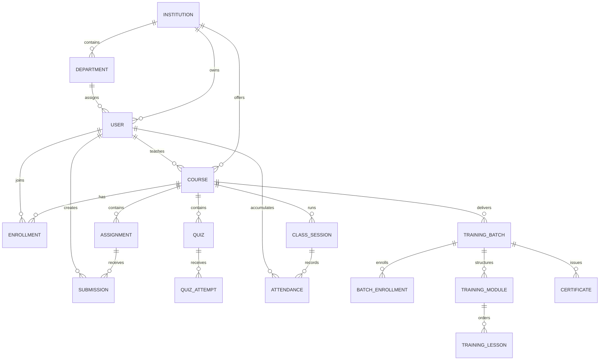

# Data model

EKEEKRTA uses SQLAlchemy models with PostgreSQL in public deployment and SQLite for isolated local development. The ERP sandbox has a separate schema and database.

## Core relationship overview

The diagram highlights major ownership relationships; it intentionally omits operational and audit tables for readability.

## Institution and identity

| Model | Purpose |
| --- | --- |
| `Institution` | Tenant identity, type, status, official domain, branding, theme and grading configuration |
| `Department` | University department or training domain within one institution |
| `User` | Account, password hash, role, official ID, institution and optional department/cohort fields |
| `GoogleIdentity` | Link between a verified Google subject and an existing EKEEKRTA account |
| `PasswordResetToken` | Hashed, expiring and consumed reset-token record |
| `PlatformAuditLog` | Operator actions affecting institution lifecycle |

User roles include platform administrator, institution administrator, HOD, faculty and student. Training tenants present faculty/student as trainer/learner and do not use HOD workflows.

## Learning management

| Model | Purpose |
| --- | --- |
| `Course` | Institution-owned academic, non-academic or training program definition |
| `Enrollment` | Student membership in a course |
| `Assignment` / `Submission` | Work definition, submission URL, marks and feedback |
| `Quiz` / `Question` / `QuizAttempt` | Multiple-choice assessment and scored attempt |
| `StudyMaterial` | Course resource categorized as notes, exam or previous-year question |
| `ProgrammingAssessment` | Coding task tied to a course |
| `ProgrammingTestCase` | Visible/hidden input, expected output and points |
| `ProgrammingSubmission` | Submitted source, runner result and score |

Correct quiz options and hidden programming cases are stored server-side and filtered from unauthorized student responses.

## Classroom and attendance

| Model | Purpose |
| --- | --- |
| `ScheduledClass` | Future class plan, ownership and optional batch link |
| `ClassSession` | Actual room, start/end state, fullscreen policy and course/batch association |
| `Attendance` | Student join/leave interval and calculated duration for a session |

Attendance percentage is derived from stored sessions/records. Ending a class finalizes the full enrolled roster so “never joined” is represented rather than silently omitted.

## Training delivery

| Model | Purpose |
| --- | --- |
| `TrainingBatch` | Dated delivery, status, capacity, trainer and certificate thresholds |
| `TrainingBatchEnrollment` | Learner membership and active/completed state |
| `TrainingModule` | Ordered batch module |
| `TrainingLesson` | Ordered lesson with publication and requirement metadata |
| `TrainingLessonCompletion` | Learner completion evidence |
| `TrainingCertificate` | Unique certificate number and retained eligibility snapshot |

## Integrations and exchange

| Model | Purpose |
| --- | --- |
| `ERPIntegration` | Encrypted per-institution ERP configuration and enabled sync directions |
| `ERPSyncEvent` | Durable outbound course/attendance event, attempts and delivery state |
| `DataExchangeProfile` | Reusable mapping from EKEEKRTA fields to an external table template |
| `GoogleDriveConnection` | Encrypted trainer OAuth credentials/metadata |
| `GoogleDriveOAuthState` | Short-lived OAuth correlation state |

## Native AI and recording

| Model | Purpose |
| --- | --- |
| `AIAction` | Proposed, confirmed, rejected or completed user action |
| `AIAuditLog` | Action history without copying raw secrets/media |
| `AITrainingExample` | Explicitly consented correction for later reviewed training |
| `AICGPAGoal` | Student goal, planning inputs and bounded checkpoint history |
| `AIKnowledgeSource` | Course-owned source text and student-publication flag |
| `AILectureContent` | Extractive digest, review state and publication state |
| `AILectureRecording` | Private recording metadata, hash and retention state |
| `AILecturePreparationJob` | Queued/processing/completed/failed private worker job |

## Separate ERP schema

The ERP sandbox maintains its own `Student`, `Course`, `AttendanceRecord`, `OfflineClassSession`, `AcademicResult`, `SyncReceipt` and `WhatsAppNotification` tables. `SyncReceipt` and notification uniqueness rules provide idempotency across retries.

EKEEKRTA never joins directly against ERP tables; it uses the documented HTTP contract.

## Schema evolution

Startup creates missing tables and includes reviewed compatibility helpers for the project’s current deployment. This is convenient for a prototype but not a substitute for formal migrations. Before production adoption:

1. introduce Alembic revision files;
2. rehearse forward and rollback behavior on a restored database;
3. stop writes during incompatible upgrades;
4. verify tenant ownership and foreign keys after migration; and
5. retain tested backups until application and data verification finish.
