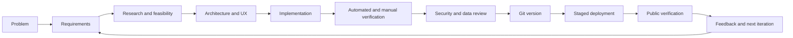

# Development life cycle

EKEEKRTA uses an incremental, risk-aware Agile workflow. A feature is not treated as complete because a screen exists: its data model, authorization, API, interface, tests, documentation and deployment behavior are reviewed together.

## Lifecycle

## Phase record

| Phase | Project outcome | State |
| --- | --- | --- |
| Problem discovery | Documented fragmentation across LMS, ERP, classroom, attendance and reporting | Completed |
| Requirements | Defined institution types, roles, permissions and integration boundaries | Completed; evolves by iteration |
| Architecture | Split browser, application API, ERP sandbox, private worker and external providers | Implemented |
| Core LMS | Accounts, courses, enrollment, assignments, quizzes, materials and attendance | Implemented |
| Multi-tenancy | Institution profiles, role scopes, branding and platform operations | Implemented |
| University workflows | Department/HOD, cohort courses, ERP and data exchange | Implemented |
| Training workflows | Programs, batches, trainers, learners, modules, progress and certificates | Implemented |
| Classroom | Jitsi/JaaS wrapper, server authorization and real-duration attendance | Configurable implementation |
| Native AI foundation | Bounded commands, retrieval, planning, progress evidence and review gates | Implemented foundation |
| Deployment | Separate public frontend, backend and ERP sandbox | Implemented |
| Production hardening | Formal migrations, monitoring, verified onboarding, accessibility, security and recovery tests | In progress / planned |
| Private media and AI | Self-hosted Jitsi/Jibri plus evaluated institution-owned speech/OCR/generative models | Planned deployment and research |

## Definition of done for a feature

A normal feature is ready to merge when:

1. the user and authorization scope are explicit;
2. the database change preserves existing authorized data;
3. request and response schemas reject invalid input;
4. the backend checks role, institution and resource ownership;
5. the frontend shows loading, empty, success and failure states;
6. tests cover the allowed path and at least one denied path;
7. secrets and personal data are absent from commits and logs;
8. documentation identifies configuration and limitations; and
9. the production build succeeds.

High-risk features add stricter gates. Video requires real multi-device testing. Notifications require consent and deduplication. AI models require dataset governance, held-out evaluation, confidence behavior and human review. Database upgrades require a backup and restore test.

## Release flow

The public services are deployed in dependency order:

1. ERP sandbox, when its contract or UI changes;
2. backend API;
3. frontend portal; and
4. public health, protected-route and bundle verification.

GitHub remains the versioned source of truth. Deployment environment values are managed outside the repository.

## Current position

The project is in iterative verification and production-hardening. It is suitable for code review and controlled demonstration. Real institutional rollout still requires operational ownership, security/privacy review, data-processing agreements, provider credentials, backup/restore procedures and measured classroom capacity.
